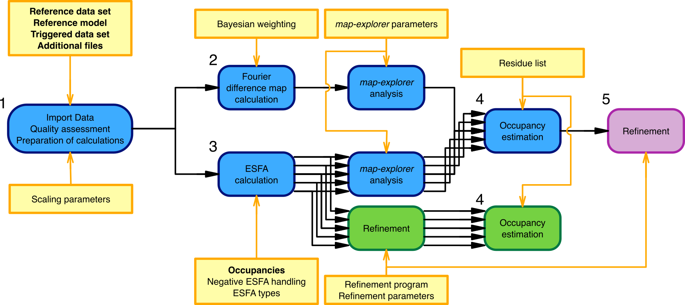
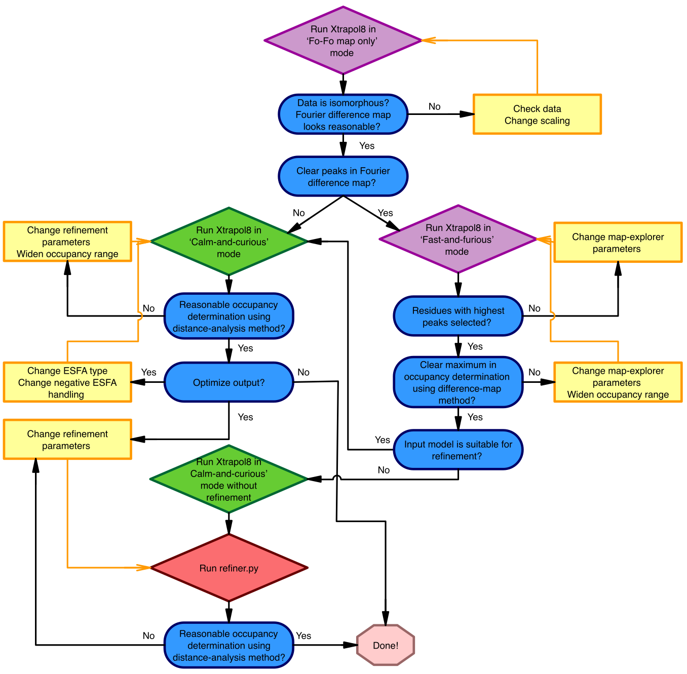
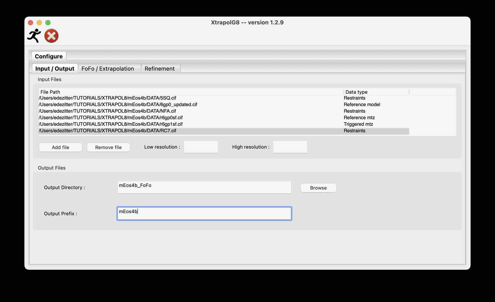
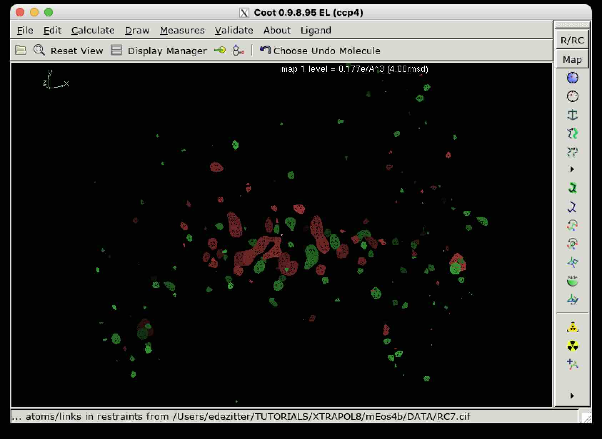
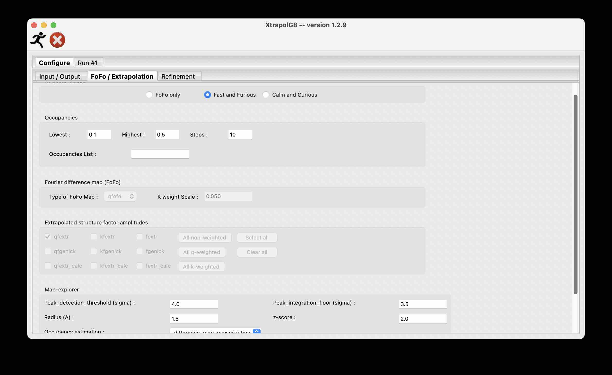
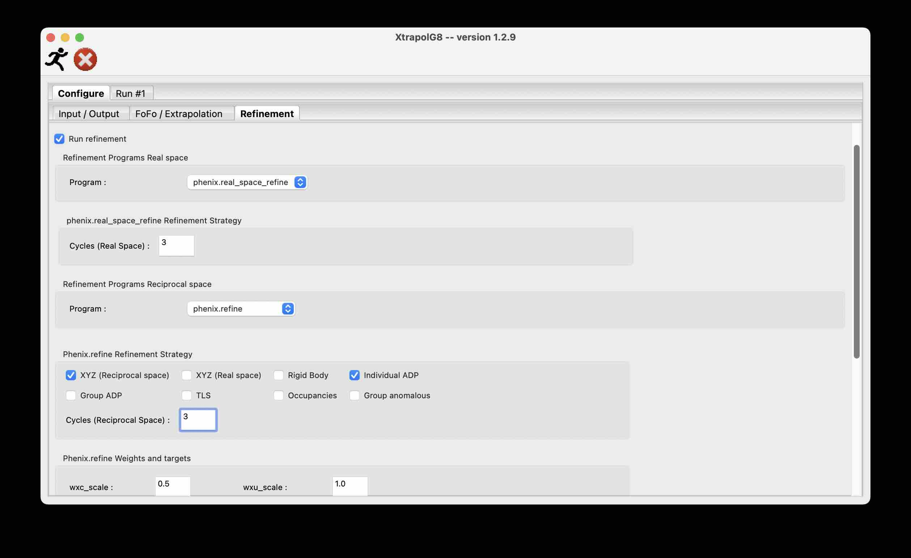
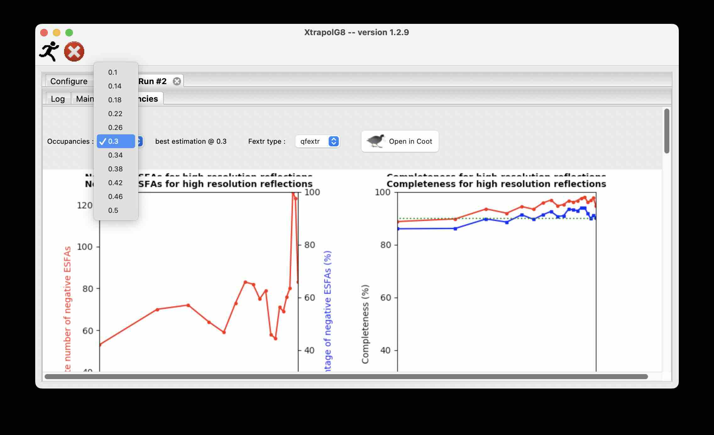
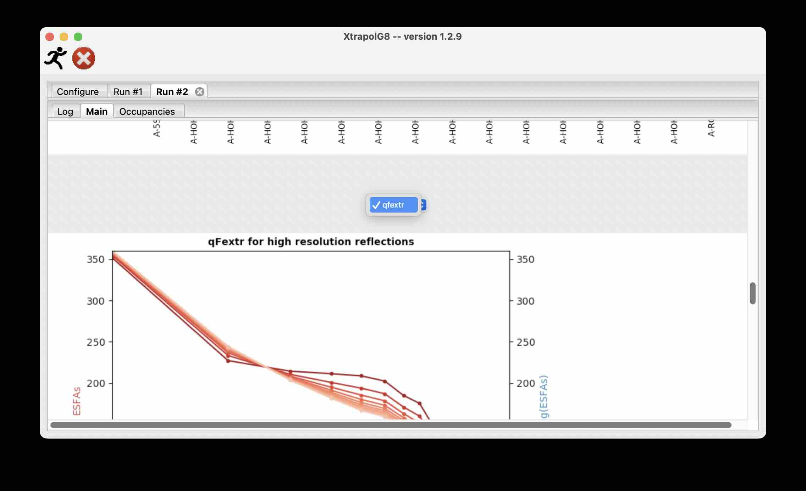
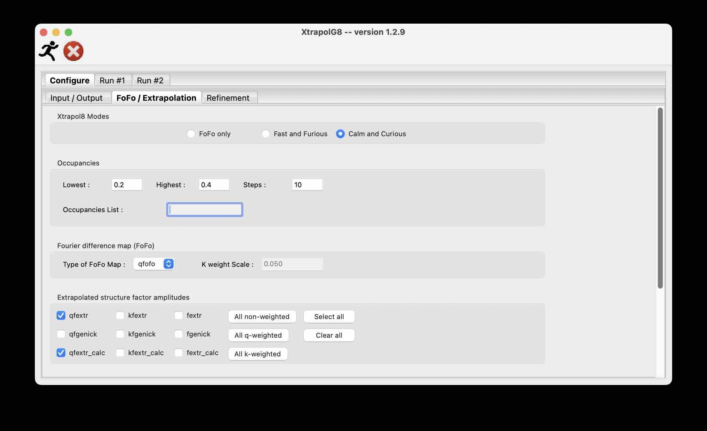
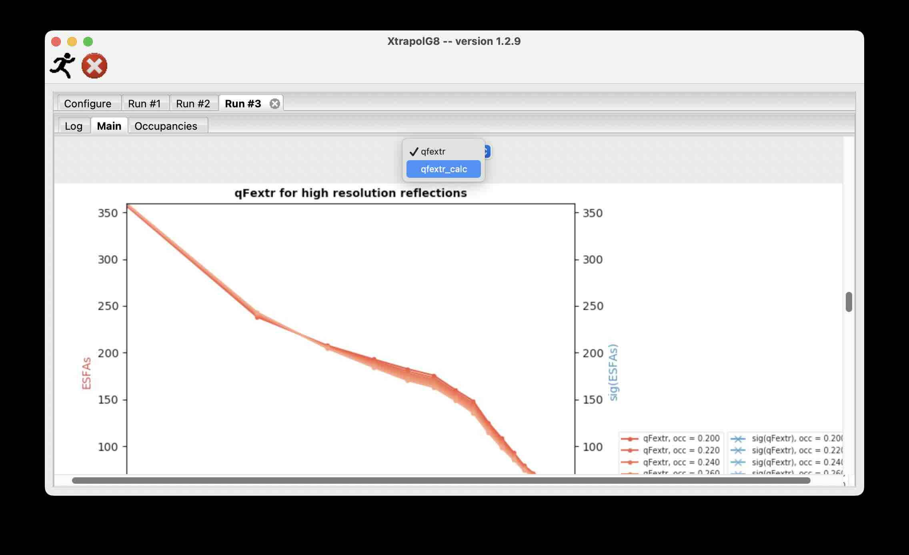

The aim of this tutorial is to reproduce one of the examples from the publication:<br />
De Zitter, E., Coquelle, N., Oeser, P., Barends, T. R. M., Colletier, J.-P., [Xtrapol8 enables automatic elucidation of low-occupancy intermediate-states in crystallographic studies](https://doi.org/10.1038/s42003-022-03575-7), Communications Biology, 5(1), 640 (2022).

# Introduction
Xtrapol8 is software that aimes at calculating Bayesian statistics weighted Fourier difference (FoFo) maps, extrapolated structure factor amplitudes (ESFAs) and at estimating the occupancy of a low-occupancy state. Xtrapol8 can be downloaded from the [Xtrapol8 Github repository](https://github.com/ElkeDeZitter/Xtrapol8).

The code is based on the cctbx toolbox which is distributed with Phenix, and uses some CCP4 programs. In order to run Xtrapol8, you will need to have a proper license for Phenix and CCP4 and have both software suites installed. Please use Phenix 1.19 or higher.<br />
Note: on Linux, Xtrapol8 will give an error when using a recent version of Phenix. How to solve this issue is documented in the Trouble shooting section of the [Command line Manual](https://github.com/ElkeDeZitter/Xtrapol8/blob/main/Xtrapol8_Command_Line_Manual.pdf).  

If Xtrapol8 was useful in your project, please cite us:
De Zitter, E., Coquelle, N., Oeser, P., Barends, T. R. M., Colletier, J.-P., [Xtrapol8 enables automatic elucidation of low-occupancy intermediate-states in crystallographic studies](https://doi.org/10.1038/s42003-022-03575-7), Communications Biology, 5(1), 640 (2022).
Don't forget to cite the software on which we build:
* Liebschner, D. et al., [Macromolecular structure determination using X-rays, neutrons and electrons: recent developments in Phenix](https://journals.iucr.org/d/issues/2019/10/00/di5033/index.html), Acta Crystallogr. D. Struct. Biol. 75, 861–877 (2019).
* Agirre, J. et al., [The CCP4 suite: integrative software for macromolecular crystallography](https://journals.iucr.org/d/issues/2023/06/00/ai5011/index.html), Acta Crystallogr. D. Biol. Crystallogr. 67, 235–242 (2011).
* Emsley, P. et al., [Features and development of Coot](https://journals.iucr.org/d/issues/2010/04/00/ba5144/index.html), Acta Crystallogr. D. Biol. Crystallogr. 66, 486–501 (2010).
* Grosse-Kunstleve, et al., [The Computational Crystallography Toolbox: crystallographic algorithms in a reusable software framework](https://journals.iucr.org/paper?ks0118), J. Appl. Crystallogr. 35, 126–136 (2002).

In this tutorial, explanations are mixed with instructions. The latter will be preceded by "->" for clarity. Not all available options in Xtrapol8 will be covered. More information about the options and output files can be found in the [Command line Manual](https://github.com/ElkeDeZitter/Xtrapol8/blob/main/Xtrapol8_Command_Line_Manual.pdf) and [GUI Manual](https://github.com/ElkeDeZitter/Xtrapol8/blob/main/XtrapolG8_Manual.pdf).

# Xtrapol8 organization
Processing consists of the following steps:



1. Reading and checking input files, and assessing data quality.
2. Calculating a (weighted) Fourier difference map, integrating the peaks in the map and attributing them the closest amino acid residues.
3. For each occupancy to test[^1]:<br />
   * Calculating the requested ESFAs and map coefficients.
   * Integrating peaks in the extrapolated difference map and attributing then to the closest amino acid residues.
   * Refining the structures in real and reciprocal space.
4. Estimating the occupancy of the triggered state using the *difference map* methods or *distance analysis* method.

[^1]: In Xtrapol8 we use the following relationship between extrapolation factor ⍺ and occupancy: ⍺ = 1/occupancy. The occupancies to test need to be adapted or differently interpreted if you would like to use a different association.

# Before you start

Check the installation instructions on [Xtrapol8 Github repository](https://github.com/ElkeDeZitter/Xtrapol8).

# Let's start

During this tutorial we follow the steps in the recommended pipeline that is outlined in the following figure.



-> Open a terminal and make a directory in which you want to work and move into it:
```bash
mkdir <my_folder>
cd <my_folder>
```

# Running Xtrapol8 and XtrapolG8
## Xtrapol8
*Fextr.py* is the main script to run Xtrapol8 through the command line.<br />
It should be launched as:
```bash
phenix.python <installation-path>/Xtrapol8/Fextr.py
```
As stated in the manual, an alias can be generated:
```bash
alias X8='phenix.python <installation-path>/Fextr.py'
```
During this tutorial, we will use the alias X8 instead of the full command.

To get information on all options, the easiest way is to run Xtrapol8 without any argument in the command line:
```bash
X8
```

## XtrapolG8
*X8\_gui.py* is the script to launch the graphical user interface (GUI), which we call XtrapolG8.<br />
It should be launched as:
```bash
phenix.python  <installation-path>/Xtrapol8/X8_gui.py
```
As stated in the manual, an alias can be generated:
```bash
alias XG8='phenix.python  <installation-path>/X8_gui.py'
```
During this tutorial, we will use the alias XG8 instead of the full command.

You can choose to supply the various input files and parameters upon launching XtrapolG8; to fill in the fields manually in the GUI; or to supply an input file.
In all cases, each of the files and parameters can be altered afterwards. An example input .phil file with all options and an example with some minimal options can be found on the [Xtrapol8 Github repository](https://github.com/ElkeDeZitter/Xtrapol8).

# Tutorial data
We will use the mEos4b example, which is also used in the original Xtrapol8 publication. The data and models can be found in [examples/mEos4b/DATA](https://github.com/ElkeDeZitter/Xtrapol8-tutorial/tree/first_version/examples/mEos4b). They were downloaded from the PDB ([6gp0](https://www.ebi.ac.uk/pdbe/entry/pdb/6gp0) and [6gp1](https://www.ebi.ac.uk/pdbe/entry/pdb/6gp1)). The ligand restraints were generated with phenix.elbow.<br />


| File        | Input type                     | Description |
| ---         | ---                            | ---         |
| r6gp0sf.cif | Reference mtz | Structure factor amplitudes collected on a reference crystal (F<sub>obs,ref</sub>) |
| r6gp1sf.cif | Triggered mtz | Structure factor amplitudes collected on a triggered crystal (F<sub>obs,trig</sub>) |
| 6gp0.cif    | Reference pdb | Model refined in the reference structure factor amplitudes |
| 5SQ.cif     | Restraints / Additional files | Restraints for ligand (covalently bonded chromophore in this case) |
| RC7.cif     | Restraints / Additional files | Restraints for ligand (covalently bonded chromophore in this case) |
| NFA.cif     | Restraints / Additional files | Restraints for modified amino acid |

# First Fourier difference map in *FoFo only* mode

-> Launch XtrapolG8 without arguments (if not already open):
```bash
XG8
```

## Input / Output
After launching XtrapolG8, you will land on the *Configure* tab which contains sub-tabs. The first one is *Input / Output*. Here, you will need to upload your data, model and additional files, you can alter the resolution, define an output name and output folder.

### Input Files
-> Add the input files:
* Press the *Add file* button and select the six files
* Give the appropriate Data type to each of the files using the right mouse button. The following data types exist:
  - **Reference mtz**<br />
Data for the reference/ground/untriggered/unperturbed state in mtz or mmcif format. For example, in case of a photo-induced process, this is the data when no laser light is applied; in case of a compound-induced process, this is the data before addition or release of the compound.
  - **Triggered mtz** <br />
Data for the low-occupancy/triggered/excited/perturbed state in mtz or mmcif format. For example, this is the data when the crystal(s) have been subjected to laser light, a compound,... This data contains the triggered state at low occupancy.<br />
Ideally, the unit cell and space group of this data is identical to the reference\_mtz. If this is not the case, the space group and unit cell of the *Reference pdb* will be transferred to this data set. The isomorphism statistics (Riso and CCiso values) will indicate whether this is allowed.
  - **Reference pdb** <br />
Model for the reference/ground/untriggered/unperturbed state in pdb or mmcif format. Preferably, this model is refined with the reference data.
  - **Restraints/ Additional files** <br />
Additional library file for non-standard residues, in cif format. Multiple cif files can be added.

### Resolution boundaries
-> For the first run, we won't alter the resolution boundaries.

### Output prefix and directory
- **Output Prefix**<br />
Name to be used as suffix or prefix in several output files. The basename of the triggered\_mtz will be used in case *Output Prefix* is not specified.
- **Output Directory**<br />
Directory in which the output will be stored. If not specified, then the output will appear in a new directory called "Xtrapol8". If the directory already exists and is not empty, Xtrapol8 will create a new one using the specified *Output Directory* name followed by a number.  
Note: When launching Xtrapol8 runs rapidly one after the other, the automatic recognition of already existing output directories will fail and multiple Xtrapol8 runs will try to write in the same directory. This might give errors or can pass unnoticed, giving ambiguous results. We thus advice users to change the name of the output directory before launching a new run. 

-> Provide a name for the *Output directory*, e.g. *mEos4b\_FoFo* ; and the prefix, e.g. mEos4b.



## FoFo / Extrapolation
In the second tab, *FoFo / Extrapolation*, the parameters for the Xtrapol8 run can be specified.

### Xtrapol8 modes
Xtrapol8 has different  modes of operation:
- **FoFo only**<br />
Xtrapol8 will stop after the calculation and analysis of the Fourier difference map, ESFAs won't be calculated.
- **Fast and Furious**<br />
Full Xtrapol8 run whereby default parameters will be used for several parameters, and structure refinement will only be carried out using ESFAs and maps at the estimated occupancy.<br />
As the name implies, this mode is fast, hence ideal for a first run to optimize a first set of parameters or to get a fast result.
- **Calm and curious**<br />
Full Xtrapol8 run wherein the user has control over all parameters, structure refinement will be run using all ESFAs and maps.

-> Select *FoFo only* mode.<br />
Note that the number of options reduces upon selecting this mode.

### Maps and Scaling
Two Bayesian statistics weighting schemes are provided to scale the difference structure factor amplitudes and the ESFAs. In the *FoFo only* mode, they will only be applied to the |F<sub>obs,trig</sub>| - |F<sub>obs,ref</sub>| difference structure factor amplitudes. When running in the two other modes, the weighting schemes can also be applied to the calculation of ESFAs (see below). Both schemes reduce the contribution of uncertain structure factor values. 

- ***q**-weighting*<br />
*q*-weighting was the first weighting scheme as described in Ursby and Bourgeois, 1997.
- ***k**-weighting*<br />
*k*-weighting is a simplified version of *q*-weighting introduced by Ren et al., 2001. In the *k*-weighting scheme, the user has the option the specify the *K weight Scale* to be more or less stringent about outlier rejection (default = 0.05).

Using the possibility of q-weighing, *k*-weighing and no weighing, three possible Fo-Fo difference structure factor amplitudes can be calculated which are used to calculate the Fourier difference map. *q*-weighting is the default.

### Map Explorer
The *Map Explorer* module analyzes the difference maps that are generated during the Xtrapol8 runs. In *FoFo only* mode, it will only analyze the FoFo map. In the other modes, also the extrapolated difference maps will be analyzed and results will be used to estimate ⍺ (occupancy). It is thus important to find proper working parameters for *Map Explorer*:
- **Peak\_detection\_threshold**<br />
Peak detection threshold, expressed in sigmas (r.m.s.d.). Only peaks with height equal or above this value will be integrated.
- **Peak\_integration\_floor**<br />
Floor value for blob integration, expressed in sigmas (r.m.s.d.) (blob = peak consisting of at least 2 voxels). Peaks will be integrated from their maximum value towards this lower bound to avoid integration of noise.
- **Radius**<br />
Maximal radius for blob annotation to closest amino acid residue. If not defined, the high resolution cutoff (defined or implied by the mtz files) will be used.
- **z\_score**<br />
Z-score cutoff to select  only the highest integrated peaks.

->In a first run it is good to start with all default options (*qFoFo* map type).<br />

-> Press the *Run* button at the top left (the little running man) to start the first Xtrapol8 run in *FoFo only* mode.

## After the *FoFo only run*
Upon running Xtrapol8, a new tab will be added called "Run\#1", this will contain the following content:
- **Log**<br />
This tab depicts the Xtrapol8 status and shows the Xtrapol8 log file.
- **Main**<br />
This tab shows the main graphs.<br />
One of the figures of the main tab is not however not shown (sorry for the bug). It can be visualized if the full run output is reloaded in XtrapolG8:
  - File > *Load Results*
  - Select the output directory

### Coot
When Xtrapol8 is run in *FoFo only* mode, a button to load the model and map in Coot is activated in the *Log* tab. Upon pressing this button, the reference model and FoFo map are automatically loaded in Coot.<br />
For unknown reasons, the Coot button might not work on certain systems (sorry for yet another bug). The Coot script can then be launched from a terminal:
```bash
coot --script mEos4b_FoFo/coot_all_qFo-Fo.py
```

### Figures in *Main* tab

See [Command line Manual](https://github.com/ElkeDeZitter/Xtrapol8/blob/main/Xtrapol8_Command_Line_Manual.pdf) for examples of the images.

- **Riso and CCiso for high resolution reflections**<br />
Plot indicating the isomorphism between F<sub>obs,trig</sub>  and F<sub>obs,ref</sub>, shown as Riso and CCiso as a function of resolution. <br />
An overall Riso value below 10 \% indicates that the two data sets are strongly isomorphous. However, this is often not the case and can deteriorate the quality of the maps and final results.
An Riso value below 0.25 for the highest resolution shell is highly recommended, but higher values are tolerated (dependent from case to case). At low resolution, the Riso value should be below 5\% or at least below 10 \%.

- **Average q for high resolution reflections** and **Average k for high resolution reflections**<br />
Plot showing the average q or k values and its range versus resolution.<br />
These plots are always shown, regardless of the selected Bayesian weighting strategy.

- **Summed difference peaks**<br />
Plot showing the positive and negative integrated peak area on top of a 1D representation of the amino acid sequence and secondary structure.<br />
⍺-helices are depicted as pink bars whereas β-strands are depicted by blue triangles; summed positive and negative integrated peaks in the FoFo map are depicted as positive green and negative red bars, respectively.
Ligands and water molecules are show on a separate plot at the bottom, if they have associated difference map peaks as determined by *Map Explorer*.
For the ease of comparison, the y-axis has the same range in all subplots.

### Interpret the results
-> Open the results in Coot and look at the plots in the Xtrapol8 output. Try to answer to the following questions:
- Are the data isomorphous?
- Should we restrict the resolution?
- Are the shapes of the q- and k-weight (with *K weight scale*=0.05) plots distinct from each other? What would you conclude from their comparison?
- Are there clear peaks in the Fourier difference maps?
- Can the Fourier difference map be easily interpreted?
- Are difference map peaks found on specific amino acid residues? If you disable the model in Coot, do you find peaks everywhere in the asymmetric unit or only at specified locations? Can you find an r.m.s.d. level that gives you difference map peaks that clearly stand out of the noise?


-> Based on the interpretation of the first results, which parameters would you like to alter? Adapt them and run again. Use the questions from above to evaluate the performance of your new run compared with the first run.

# First *Fast and furious* run
Based on the results from the run(s) in *FoFo only* mode, we can now proceed with full structure factor extrapolation.

## Input / Output
-> In the *Input / Output* tab, change the *Output Directory* , e.g. mEos4b\_fast

## FoFo / Extrapolation
-> In the *FoFo / Extrapolation* tab, change to the *Fast and Furious* mode.<br />
Note that several new parameters have become available, but several parameters will be restricted to the default values and cannot be altered.

### Occupancies
You can specify a list of occupancies to test. This can be done in two ways:
- **Lowest**, **Highest** and **Steps**<br />
Define the lowest and highest occupancies to test and the number of steps between them.
- **Occupancy List**<br />
Provide the specific occupancies to test (separated by a space). If a list is provided, it will overwrite the *Lowest, Highest and Steps* method to define the occupancies.

-> Adapt the field to test 10 occupancies between 0.1 and 0.5.

### Extrapolated structure factor amplitudes and map coefficients
Different methods for the calculation of ESFAs are implemented in Xtrapol8, but only a single one is used in *Fast and furious* mode. 
The *qfextr* type of structure factor amplitude extrapolation is the default one, in which *q*-weighting is applied.

More information concerning extrapolation types can be found in the [Command line Manual](https://github.com/ElkeDeZitter/Xtrapol8/blob/main/Xtrapol8_Command_Line_Manual.pdf).


| type | Extrapolated structure factors | Map Coefficients <br /> 2F<sub>extrapolated</sub>-F<sub>calc</sub> type | Map Coefficients <br /> F<sub>extrapolated</sub>-F<sub>calc</sub> type |
| --- | --- | --- | --- |
| qfextr| qF<sub>extr</sub> = ⍺ ⨉ q/\<q\></sub> ⨉ (F<sub>obs,trig</sub>-F<sub>obs,ref</sub>) + F<sub>obs,ref</sub> | 2m\|qF<sub>extr</sub>\|-D\|F<sub>calc</sub>\|, φ<sub>ref,calc</sub> | m\|qF<sub>extr</sub>\|-D\|F<sub>calc</sub>\|, φ<sub>ref,calc</sub> |

with ⍺ = 1/occupancy[^1]<br />

### Map Explorer
An additional parameter has appeared under the *Map Explorer* settings: *Occupancy Estimation*.<br />
Here, the methods to estimate the occupancy of the triggered state can be selected. Xtrapol8 currently has three build-in methods to estimate this. All methods that are compatible with the input parameters will be run and results shown, but only the selected one will be used for further refinement and analysis.<br />
In the *Fast and furious* mode, the following two *Difference map* methods are available:
- **difference map maximization**<br />
The first *difference map* method uses the Fourier difference (m(\|F<sub>obs,trig</sub>\|-\|F<sub>obs,ref</sub>\|)) and extrapolated difference maps (m\|qF<sub>extr</sub>\|-D\|F<sub>calc</sub>\|). The integrated peaks around the selected residues will be used to estimate the occupancy of the triggered state and annotate the most probable extrapolated structure factors. These steps are automatically done by *Map Explorer*:
  1. Using the peak\_detection\_threshold parameter, select the peaks in the m(\|F<sub>obs,trig</sub>\|-\|F<sub>obs,ref</sub>\|) map that are within the specified radius of an atom in the reference model.
  2. Integrate the m(\|F<sub>obs,trig</sub>\|-\|F<sub>obs,ref</sub>\|) peaks from their maximum value down to the peak\_integration\_floor (if we integrate to zero we'll get one big blob that spreads over the entire asymmetric unit).
  3. Make a histogram of the m(\|F<sub>obs,trig</sub>\|-\|F<sub>obs,ref</sub>\|) peaks and select only the highest using the z\_score parameter. All map voxels outside of these selected peaks are masked in the following step.
  4. Using the mask, integrate the same peaks in the m\|qF<sub>extr</sub>\|-D\|F<sub>calc</sub>\| map, sum the positive peaks, sum the negative peaks and make the sum of the absolute values, divide by the positive/negative/all peaks of the m(\|F<sub>obs,trig</sub>\|-\|F<sub>obs,ref</sub>\|) map and plot their values and search for the maximum of the sum.
- **difference map Pearson CC**<br />
In the second *Difference map* submethod a standard Pearson correlation coefficient between the m(\|F<sub>obs,trig</sub>\|-\|F<sub>obs,ref</sub>\|) map and the m(\|F<sub>obs,trig</sub>\|-\|F<sub>obs,ref</sub>\|) maps is calculated. Here, the map covering the entire asymmetric unit is used. This should generate a very similar result to the first plot unless noise or artifacts appear, e.g. big peaks in the solvent channel. 

-> From the previous *FoFo only* run(s), we already know that strong difference map peaks exist. We can thus start with the default method *difference map maximization*, but we should inspect the results from the *Pearson CC* as well after the run.



## Refinement
In the *Refinement* tab, the parameters for the automatic refinements can be specified.

In *Fast and furious* mode, Xtrapol8 will automatically refine the structure at the best estimated ⍺ (occupancy). It will run 3 subsequent refinements:
1. Reciprocal reciprocal space refinement using the ESFAs and *Reference pdb*.
2. Real space refinement using the extrapolated map and *Reference pdb*.
3. Real space refinement using the map and model originating from the reciprocal space refinement (refinement 1).

The following parameters have to set:
- **Perform Refinement with software** <br />
Real space refinement can be carried out with phenix.real\_space\_refine or with Coot.<br />
Reciprocal space refinment can be carried out with phenix.refine or Refmac5.<br />
Unticking the box avoids running any type of refinement. This is useful for cases in which a manual intervention is needed before refinement. This can be for ligand binding studies as the ligand is not present in the input model; when the conformational changes are too large to be captured by the automatic refinements; or a bond break takes place. The automatic refinements and subsequent analyses can be still be executed using the *refiner.py* script (outside the scope of this tutorial).
- **Refinement options**<br />
Depending on the chosen programs, different parameters can be selected. Please consult the Phenix and CCP4 documentation for more information.

-> Select the refinement program with which you have most experience. If you have no experience or preference, you can select Phenix.refine and Phenix.real_space_refine with the following parameters: 
- *Refinement Strategy*: XYZ (Reciprocal space) + Individual ADP
- *Cycles (Reciprocal space)*: 3
- *Cycles (Real space)*: 3
- *Other options*: Ordered solvent



-> Press the *Run* button to start this first *Fast and Furious* Xtrapol8 run.

## After the *Fast  and furious run*
In addition to the *Log* and *Main* tabs, another tab appeared in the output file:

- **Occupancies**<br />
This tab shows the results for ESFAs, each calculated with a distinct ⍺ value (occupancy).



### Coot
In *Fast and furious* and *Calm and curious* mode (see below), the button to open Coot can be found in the *Occupancies* tab. A Coot session is only generated for the best estimated occupancy, which can be selected from the drop-down menu. Upon pressing this button, several models and maps open:
- Models:
  - Reference model
  - Model from reciprocal space refinement (refinement 1)
  - Model from real space refinement (refinement 2)
  - Model from real space refinement after reciprocal space refinement (refinement 3)
- Maps:
  - 2Fo-Fc and Fo-Fc map from reciprocal space refinement (refinement 1)
  - 2Fextr-Fc and Fextr-Fc map directly after extrapolation (the raw extrapolated maps)
  - FoFo map


The Coot script can be launched from the command line, in case the button is not reactive:
```bash
coot --script mEos4b_fast/qweight_occupancy_0.300/coot_all_qFextr.py
```

### Selected figures in the *Main tab*
Several graphs are added in the *Main* tab as compared the output of the *FoFo only* run. Here we discuss only a few of them.<br />
See [Command line Manual](https://github.com/ElkeDeZitter/Xtrapol8/blob/main/Xtrapol8_Command_Line_Manual.pdf) for examples of the images.

In the middle of the *Main* tab, a title dropdown menu can be found, where the ESFA type can be selected. In *Fast and furious* mode, only the *qfextr* type is available.

-> From the dropdown menu, re-select *qfextr* as ESFA type to refresh the plots. If this is not working, re-load the results as explained above.



- **qFextr for high resolution reflections**<br />
Plot showing the average ESFA (red to salmon) and their error estimation (blue to light blue) versus resolution. This plot shows how the ESFA signal and errors evolve when calculated with distinct occupancies.

- **Alpha determination / Occupancy determination**<br />
Plots showing the results of the two *Difference map* methods for the estimation of  ⍺ (occupancy). If you would like to use a different association between ⍺ and occupancy, only look at the output of the ⍺ estimation and make the coversion to occupancy accordingly. The top row shows the results of the *difference map maximization* method, the bottom row shows the result from the *difference map Pearson CC*.

### Selected figures in the *Occupancies tab*
The content of this tab will be adapted for each tested occupancy. You can choose the occupancy for which the resuls need to be depicted from the dropdown menu at the top.

- **qFextr\_FsigF: F/sig(F) for high resolution reflections**<br />
Plot showing the average extrapolated structure factors over the estimated error as a function of resolution. This plot is a different representation of the one of the main figures in which the signal and error values were show, but makes it easier to see if a resolution cutoff should be applied. F/sig(F) above 1.22 is highly recommended (I/sig(I)=1.5). Restricting the resolution can be done within Xtrapol8 or outside of Xtrapol8 before further structure refinement.

- **Distance difference matrix (ddm)**<br />
Plot showing the atomic position differences between the *Reference pdb* and the real space refined model. This plot is only generated for the model at best estimated occupancy. Ligands and water molecules are not included in the ddm.

### Interpret the results
-> Open the results in Coot and look at the plots in the Xtrapol8 output. Try to answer the following questions:
- Can a clear maximum in the occupancy estimation be found with the two methods?
- Do the two methods give a different result? How would you interpret a difference between them?
- Should the resolution be restricted?
- Do the extrapolated maps make sense?
- Is the model suitable for automatic refinement (i.e. can the automatic refinements place the triggered model well in the density?)
- Should the refinement parameters be changed?

-> Based on the interpretation of the first *Fast and furious* run, which parameters would you like to alter? Adapt them and run again. Use the questions from above to evaluate the performance of your new run compared with the first run.

# First *Calm and curious run*

 ## Input / Output
-> In the *Input / Output* tab, change the *Output Directory*, e.g. mEos4b\_calm

## FoFo / Extrapolation
-> In the *FoFo / Extrapolation* tab, change to the *Calm and Curious* mode.
Note that all parameters are enabled and can now be altered.

### Extrapolated structure factor amplitudes and map coefficients
Three different methods for calculation of extrapolated structure factors can be used. 
- **qfextr, kfextr and fextr**<br />
As described in Coquelle et al., 2018.
- **qfgenick, kfgenick and fgenick**<br />
As described in Genick et al., 2007.
- **qfextr\_calc, kfextr\_calc and fextr\_calc**<br />
As described in Terwilliger and Berendzen, 1995.

The additional possibility to weight the structure factor difference leads to nine possibilities:

| type | Extrapolated structure factors | Map Coefficients <br /> 2F<sub>extrapolated</sub>-F<sub>calc</sub> type | Map Coefficients <br /> F<sub>extrapolated</sub>-F<sub>calc</sub> type |
| --- | --- | --- | --- |
| qfextr | qF<sub>extr</sub> = ⍺ ⨉ q/\<q\></sub> ⨉ (F<sub>obs,trig</sub>-F<sub>obs,ref</sub>) + F<sub>obs,ref</sub> | 2m\|qF<sub>extr</sub>\|-D\|F<sub>calc</sub>\|, φ<sub>ref,calc</sub> | m\|qF<sub>extr</sub>\|-D\|F<sub>calc</sub>\|, φ<sub>ref,calc</sub> |
| kfextr | kF<sub>extr</sub> = ⍺ ⨉ k/\<k\></sub> ⨉ (F<sub>obs,trig</sub>-F<sub>obs,ref</sub>) + F<sub>obs,ref</sub> | 2m\|kF<sub>extr</sub>\|-D\|F<sub>calc</sub>\|, φ<sub>ref,calc</sub> | m\|kF<sub>extr</sub>\|-D\|F<sub>calc</sub>\|, φ<sub>ref,calc</sub> |
| fextr | F<sub>extr</sub> = ⍺ ⨉ (F<sub>obs,trig</sub>-F<sub>obs,ref</sub>) + F<sub>obs,ref</sub> | 2m\|F<sub>extr</sub>\|-D\|F<sub>calc</sub>\|, φ<sub>ref,calc</sub> | m\|F<sub>extr</sub>\|-D\|F<sub>calc</sub>\|, φ<sub>ref,calc</sub> |
| qfextr | qFgenick</sub> = ⍺ ⨉ q/\<q\></sub> ⨉ (F<sub>obs,trig</sub>-F<sub>obs,ref</sub>) + F<sub>obs,ref</sub> | m<sub>dark</sub>\|qF<sub>genick</sub>\|, φ<sub>ref,calc</sub> | m<sub>dark</sub>\|qF<sub>genick</sub>\|-D\|F<sub>calc</sub>\|, φ<sub>ref,calc</sub> |
| kfextr | kFgenick</sub> = ⍺ ⨉ k/\<k\></sub> ⨉ (F<sub>obs,trig</sub>-F<sub>obs,ref</sub>) + F<sub>obs,ref</sub> | m<sub>dark</sub>\|kF<sub>genick</sub>\|, φ<sub>ref,calc</sub> | m<sub>dark</sub>\|kF<sub>genick</sub>\|-D\|F<sub>calc</sub>\|, φ<sub>ref,calc</sub> |
| fextr | Fgenick</sub> = ⍺ ⨉ (F<sub>obs,trig</sub>-F<sub>obs,ref</sub>) + F<sub>obs,ref</sub> | m<sub>dark</sub>\|F<sub>genick</sub>\|, φ<sub>ref,calc</sub> | m<sub>dark</sub>\|F<sub>genick</sub>\|-D\|F<sub>calc</sub>\|, φ<sub>ref,calc</sub> |
| qfextr\_calc | qF<sub>extr\_calc</sub> = ⍺ ⨉ q/\<q\></sub> ⨉ (F<sub>obs,trig</sub>-F<sub>obs,ref</sub>) + F<sub>calc,ref</sub> | 2m\|qF<sub>extr\_calc</sub>\|-D\|F<sub>calc</sub>\|, φ<sub>ref,calc</sub> | m\|qF<sub>extr\_calc</sub>\|-D\|F<sub>calc</sub>\|, φ<sub>ref,calc</sub> |
| kfextr\_calc | kF<sub>extr\_calc</sub> = ⍺ ⨉ k/\<k\></sub> ⨉ (F<sub>obs,trig</sub>-F<sub>obs,ref</sub>) + F<sub>calc,ref</sub> | 2m\|kF<sub>extr\_calc</sub>\|-D\|F<sub>calc</sub>\|, φ<sub>ref,calc</sub> | m\|kF<sub>extr\_calc</sub>\|-D\|F<sub>calc</sub>\|, φ<sub>ref,calc</sub> |
| fextr\_calc | F<sub>extr\_calc</sub> = ⍺ ⨉ (F<sub>obs,trig</sub>-F<sub>obs,ref</sub>) + F<sub>calc,ref</sub> | 2m\|F<sub>extr\_calc</sub>\|-D\|F<sub>calc</sub>\|, φ<sub>ref,calc</sub> | m\|F<sub>extr\_calc</sub>\|-D\|F<sub>calc</sub>\|, φ<sub>ref,calc</sub> |

with ⍺ = 1/occupancy[^1]<br />

Multiple maps and types can be selected in one run. The buttons **All non-weighted**, **All q-weighted**, **All k-weighted**, **Select all** and **Clear all** facilitate filtering the desired types.<br />

-> Select at least two types of ESFAs. If the results of the *Fast and furious* run were satisfactory, keep *qfextr* as one of the options.

### Map Explorer
An additional method has appeared in the dropdown menu at *Occupancy Estimation*:  

- **Distance analysis** <br />
This method is based on a structural comparison of  *Reference pdb* with the model that underwent reciprocal and real space refinement. Also in the *distance analysis* method, the residue list arriving from the largest Fourier difference map peaks (residlist\_Zscore\<z-score\>.txt) as found by *Map Explorer* will be used. Hence, even though the maps are not directly used to estimate the occupancy, the *Map Explorer* parameters should be properly set to select the most useful amino acid residues.<br />
Briefly, all interatomic distances between the atoms of the refined and reference pdb files are calculated for the selected residues and plotted versus ⍺. To each of the distance evolutions, Xtrapol8 will try to fit a sigmoidal curve, and ⍺ will be estimated at the point where 99\% of the plateau level is reached. The overall estimated ⍺ is calculated as the average of individual estimates. Furthermore, the average of all significant distances is also plotted and an sigmoidal curve fitted, and is used as an alternative estimation.<br />
The *distance analysis* method can be useful in cases where the FoFo map does not show high and pronounced peaks. However, its results can be very dependent on the refinement parameters.

In *Calm and curious* mode, there are thus three methods to choose from to estimate the occupancy.
All methods that are compatible with the input parameters will be run and their results shown. But, only the one selected at *Occupancy Estimation* will be used for further analyses.<br />

The large conformation changes that take place upon the light trigger in mEos4b cannot be modelled automatically during the refinement steps. Therefore, running the *Distance analysis* at this stage would not be useful (it can be run after a *refiner.py* run, but that is outside the scope of this tutorial).

-> Keep the *Occupancy Estimation* method that you preferred from the *Fast and furious* run.

## Refinement
In the *Calm and curious* mode, Xtrapol8 will automatically refine the structure at all tested ⍺ values (occupancies). Therefore, a sensible *Calm and curious* run will take a while. However, it is important to go through these long runs to explore the full potential of your data.

-> You can run Xtrapol8 based on your findings from the *Fast and furious* run(s) or use the following parameters:
- 10 occupancies between 0.1 and 0.5
- 2 types of ESFAs: *qfextr* and *kfextr\_calc*
  
- Refinement parameters:
  - Phenix.refine and Phenix.real_space_refine
  - 3 cycles of reciprocal and real space refinement
  - Strategy: XYZ (Reciprocal space) + Individual ADP
  - Ordered solvent
  - Simulated annealing

## After the *Calm and curious run*
The results from the *Calm and curious* run are organized as for a *Fast and fruious* run. However, addition graphs are depicted in the *Main* tab, and all analyses are carried out for all types of selected ESFAs. Halfway the *Main* tab and at the top of the *Occupancies* tab, a dropdown menu allows to select the ESFA type for which you want to depict the results.



### Selected figures in *Main tab*

- **Distance analysis between reference and real space refined models**<br />
Plot showing the distance differences between *Reference pdb* and the models from reciprocal followed by real space refinement as a function of ⍺. The purple lines show the actual distance measurements between the reference and the refined model; the red lines show the sigmoidal fits; the dashed blue line shows the average of all fits; the green line shows the average measured distance; and the full blue line show the sigmoidal fit to average distance. The occupancy histogram shows the occupancy estimates from each individual fit.

### Interpret the results
-> Open the results in Coot and look at the plots in the Xtrapol8 output. Try to answer the following questions:
- How do the three occupancy methods related to each other? Is there a certain method you would trust or not trust in this case? What is the caveat of each method?
- Are the results from the two ESFA strategies similar?
- How would you explain that distinct extrapolation methods yield different estimated occupancy values?

-> Based on the interpretation of this *Calm and curious* run, which parameters would you like to alter or further explore? Adapt them and run again. Use the questions from above to evaluate the performance of your new run compared with the first run.
